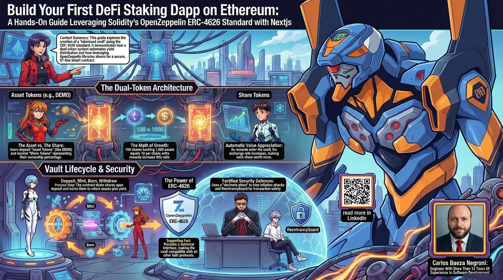

# Build Your First DeFi Staking Dapp on Ethereum: A Hands-On Guide Leveraging Solidity's OpenZeppelin ERC-4626 Standard with Nextjs

Welcome to a hands-on journey into decentralized finance where I will guide you through building a complete staking application from the ground up. I have designed this tutorial specifically for people who have never written code before, and I mean that sincerely. When I began learning about blockchain technology, I discovered that most tutorials either assumed you were already a software engineer or skipped over the fundamental concepts that matter. That frustration inspired me to create this guide. I will hold your hand through every step, explaining each concept as if we were sitting together at a computer, and by the time we finish you will have deployed a fully functional staking contract on Ethereum's Sepolia testnet along with a beautiful web interface that real users can interact with.

What we are building together is a system that lets people deposit cryptocurrency tokens into a smart contract and earn rewards automatically, without needing a bank or any intermediary. The contract we write will follow the ERC-4626 standard, which is the industry's best practice for these types of vaults. This means your work will be production-quality code that demonstrates how professional developers build secure financial applications. The web interface will be built with Next.js, giving you a modern React application that connects to the blockchain through your wallet.

I want to be completely clear about what this tutorial involves. We will start from zero, with a blank editor screen, and write our smart contract line by line in Solidity. I will explain what each keyword means and why we need it. We will then write tests to verify our contract works correctly, which is what professional developers do before deploying any code. After that, we will configure our deployment to Sepolia testnet, which is a practice version of Ethereum where you can get free test tokens that have no real monetary value. Then we will deploy our contract and interact with it through the web interface I have prepared. Throughout this process I will explain what is happening at each moment, why each step matters, and how the different pieces fit together.

This is not a copy-paste tutorial where you mindlessly run commands. I want you to understand what is happening. When we run a command in the terminal, I will explain what that command does and why we are running it. When we write code, I will explain the purpose of each line. When we deploy to the blockchain, I will walk you through what a transaction actually is and what it means for something to be on-chain. My goal is that when you complete this tutorial, you will understand how staking contracts work at a fundamental level, and you will have the confidence to explore more advanced topics on your own.

The code you will write is intentionally minimal because we are using OpenZeppelin's library of secure, battle-tested smart contract components. This library has been audited by security experts and used in thousands of production contracts. By building on this foundation, you will learn the right way to construct financial smart contracts without introducing vulnerabilities. Our contract itself will be about thirty-seven lines of code, but those thirty-seven lines represent powerful functionality that would have required pages of legal documents and intermediaries in traditional finance.

I have also prepared a complete article in the article.md file that explains the philosophy behind the design, walks through the code in detail, and discusses important security considerations. That article is optional reading as you go through the tutorial, but I encourage you to read it before or after the hands-on work, as it will deepen your understanding of why these systems are built the way they are. The article covers topics like the two-token architecture that enables automatic rewards distribution, why standards like ERC-4626 matter, and what makes this approach secure against common attacks.

This tutorial is safe because we are using testnet. You cannot lose real money. I will show you how to get free test ETH to pay for transaction fees, and the tokens you stake are worthless test tokens. This means you can experiment freely without any financial risk. However, I must emphasize: do not deploy this code to mainnet or use it with real cryptocurrency without extensive security auditing by professionals. The code we write is for educational purposes and has not been through a full security review.

My teaching philosophy is that complex topics become approachable when we break them down into small pieces and explain the purpose behind each piece. I will not use technical jargon without defining it first. If I say something like "transaction" or "smart contract" or "gas," I will immediately explain what that term means in plain language. There are no stupid questions here, and I encourage you to pause the tutorial whenever something is unclear and re-read that section until it makes sense.

So let us begin this adventure together. You do not need any special background other than basic computer literacy and a willingness to learn. I will provide everything else: the code, the explanations, the tools, and the encouragement. By the end, you will have built something real that lives on a global blockchain network, and you will understand how it works from the inside out. That is my promise to you.

## Social Media & Announcements

Follow along with the project development and announcements:

- [LinkedIn Announcement](https://www.linkedin.com/posts/carlos-baeza-negroni_staking-erc4626-erc20-activity-7438194156272959488-LK9B)
- [LinkedIn Article](https://www.linkedin.com/pulse/build-your-first-defi-staking-dapp-ethereum-hands-on-baeza-negroni-46wyf)
- [X/Twitter Thread](https://x.com/cjbaezilla/status/2032432576363712548)

## What we're making

We are building a staking application that lets people earn rewards on their cryptocurrency tokens. Think of it like a digital piggy bank that pays you interest for keeping your coins inside. You put your tokens in, the system works for you, and you can take them out anytime with your earned rewards included.

Our finished project has two main parts that work together:

### The blockchain brain (the smart contract)

Inside the [`hardhat`](./hardhat) folder is the code that runs on the Ethereum blockchain. This is the rule-keeper that handles all the money stuff. It tracks who deposits tokens, calculates rewards automatically, and sends funds back when people withdraw. We built this using the ERC-4626 standard, which is like an industry rulebook for staking systems. Making our contract follow this standard means it is built the same way professional projects do. You'll also find tests that check everything works right, plus files that prepare the contract for deployment.

### The friendly front door (the web interface)

The [`nextjs`](./nextjs) folder holds the website that people will actually use. This is the pretty part that shows up in your browser. Users can connect their crypto wallet, see how many tokens they have, press buttons to stake or withdraw, and watch their rewards grow. I designed it with a clean dark theme and smooth animations so it feels professional and trustworthy. This part translates all the complex blockchain actions into simple clicks and clear information.

### Your complete roadmap

The [`article.md`](./article.md) file is your guide through the entire build. I wrote it for total beginners, walking you through every step from installing software to deploying the contract. Every command gets explained, every concept gets broken down, and you'll never be left wondering what something means. You can go at your own speed and revisit sections anytime.

By the end you will have both a smart contract living on the Ethereum testnet and a beautiful website that real people can use to stake their tokens. The best part is that you will understand exactly how every piece works because I will explain it all in plain language.

## Why Sepolia testnet

Sepolia is like a practice environment for Ethereum. Here's why it's perfect for learning:
- You can't lose real money
- We'll get free test ETH to pay fees
- It runs the same technology as real Ethereum
- Anything you deploy doesn't cost actual dollars

## What to have ready

You'll need to install a few things on your computer:
- A text editor (VS Code works well)
- Node.js (the installer will guide you)
- Metamask extension for your browser
- Some Sepolia test ETH (I'll show where to get it)
- Basic comfort with opening a terminal

Don't worry about the technical terms. I'll break each step down.

## DISCLAIMER

**THIS CODE IS FOR TESTING AND EDUCATIONAL PURPOSES ONLY.**

This implementation has **NOT** been audited for production use. Do **NOT** deploy this code to mainnet or use it with real funds without a comprehensive security audit by qualified professionals. The code is provided as-is with no warranties. Use at your own risk.

**Key Points:**
- For learning and testing only
- No security guarantees
- Requires professional audit before production
- Never use with real cryptocurrency

## Important safety reminder

This is purely educational. The tokens you'll use are test tokens with no value. I cannot stress enough: do not try this with real cryptocurrency until you truly understand what you're doing. The code we write here is for learning, not production use. It lacks the security checks that real contracts need.